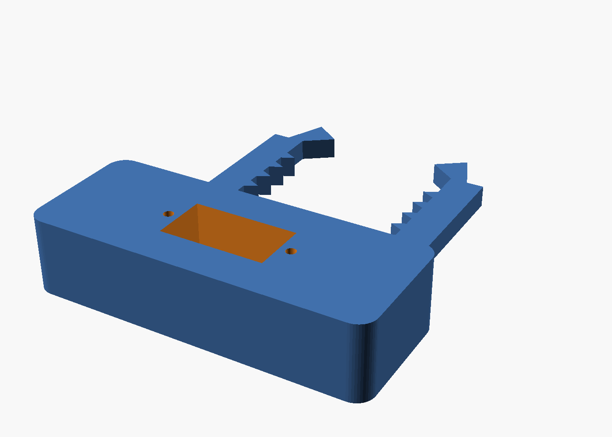
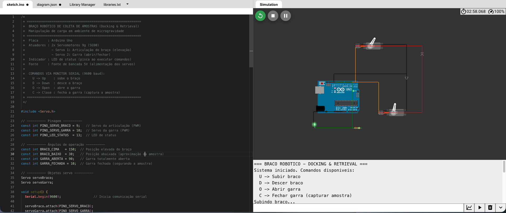

# 🦾 Braço Robótico de Coleta de Amostras (Docking & Retrieval)

Projeto de braço robótico para **manipulação de carga em ambientes de microgravidade**, controlado por comandos de teclado via Monitor Serial. Desenvolvido para a disciplina de [NOME DA DISCIPLINA].

## 👥 Integrantes

| Nome completo                     |
| --------------------------------- |
| Samuel Ramos de Almeida - RM99134 |

## 🔗 Acesso ao Simulador

**Link público do projeto (Wokwi):** [[LINK DO PROJETO](https://wokwi.com/projects/466386470549992449)]

## 🎮 Guia de Operação

1. Abra o link do simulador e clique no botão verde **▶ (Play)** para iniciar.
2. Clique na aba do **Monitor Serial** (parte inferior da tela no Wokwi).
3. Confirme que a velocidade está em **9600 baud**.
4. Digite um dos comandos abaixo e pressione **Enter**:

| Comando | Ação                                                | Servo acionado    |
| :-----: | --------------------------------------------------- | ----------------- |
|   `U`   | **Up** — Sobe o braço (150°)                        | Servo 1 (pino 9)  |
|   `D`   | **Down** — Desce o braço até a amostra (30°)        | Servo 1 (pino 9)  |
|   `O`   | **Open** — Abre a garra (90°)                       | Servo 2 (pino 10) |
|   `C`   | **Close** — Fecha a garra e captura a amostra (10°) | Servo 2 (pino 10) |

**Sequência típica de coleta:** `O` → `D` → `C` → `U` (abre a garra, desce, captura e sobe com a amostra).

O **LED de status** (pino 13) permanece **aceso** quando o sistema está pronto e **apaga durante a execução** de um movimento, acendendo novamente ao concluir. Comandos maiúsculos e minúsculos são aceitos; comandos inválidos geram mensagem de erro no Monitor Serial.

## ⚙️ Especificações Técnicas

### Alimentação

- **Fonte de bancada configurada em 5V** (faixa segura para servos SG90: 4,8V–6V), alimentando exclusivamente os servomotores.
- O Arduino Uno é alimentado via USB no simulador.
- **GND comum** entre a fonte de bancada e o Arduino (obrigatório para o sinal PWM funcionar).

### Pinagem do Arduino Uno

|   Pino    | Componente                            | Função                     |
| :-------: | ------------------------------------- | -------------------------- |
| D9 (PWM)  | Servo 1 — Articulação do braço        | Sinal de controle          |
| D10 (PWM) | Servo 2 — Garra                       | Sinal de controle          |
|    D13    | LED de status (com resistor de 220 Ω) | Indicação de funcionamento |
|    GND    | Fonte de bancada + LED                | Referência comum           |

### Firmware

- Comunicação serial a **9600 baud**.
- Movimentos **suaves (grau a grau, 15 ms por passo)**, evitando trancos que deslocariam a carga em microgravidade.

## 🧊 Modelagem 3D

- **Software utilizado:** OpenSCAD (modelagem paramétrica por código).
- **Peça desenvolvida:** Garra (grip) de captura com encaixe para servo 9g (SG90).

### Características do design

- **Rebaixo de encaixe** com as dimensões exatas do servo SG90 (23,2 × 12,5 mm) e furos para parafusos M2;
- **Dentes de retenção** na face interna dos dedos e **ganchos na ponta**, impedindo que a amostra escape ao flutuar em microgravidade;
- **Totalmente paramétrico:** todas as dimensões (comprimento dos dedos, abertura da garra, espessura, número de dentes) são variáveis ajustáveis no início do arquivo `garra.scad`.

```scad
comprimento_dedo = 50;  // Comprimento de cada dedo (mm)
abertura_garra   = 40;  // Distância entre os dedos (mm)
espessura        = 5;   // Espessura das peças (mm)
num_dentes       = 5;   // Dentes de retenção
```

## 📁 Estrutura do Repositório

```
├── src/
│   ├── braco_robotico.ino   # Código-fonte do Arduino
│   └── diagram.json         # Diagrama do circuito (Wokwi)
├── model/
│   ├── garra.scad           # Projeto nativo (OpenSCAD)
│   └── garra.stl            # Exportação universal para impressão 3D
├── images/
│   ├── modelo_3d_garra.png  # Render do modelo 3D
│   └── circuito_wokwi.png   # Captura de tela do circuito simulado
└── README.md
```

## 🖼️ Imagens

### Modelo 3D da garra



### Circuito simulado


